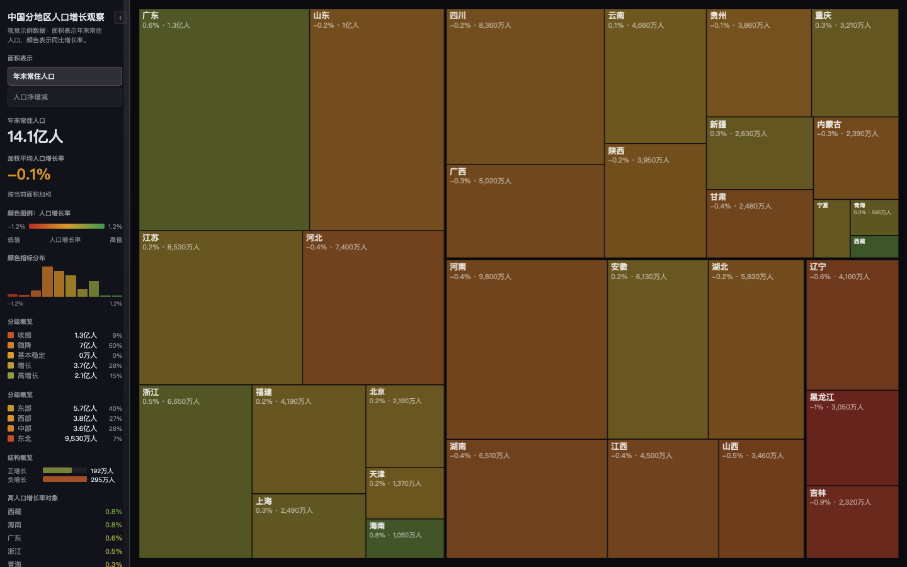

# 📊 Data Observatory Dashboard Skill

<div align="center">

**高密度数据观察仪表盘 — 矩形树图方法论与交互式可视化工具**

[](https://opensource.org/licenses/MIT)
[](https://github.com/CSlawyer1985/data-observatory-dashboard-skill)
[-orange.svg)](https://github.com/CSlawyer1985)
[](https://claude.ai/)

矩形树图方法论 | 数据画像 | 单位硬约束 | 静态 HTML 零依赖 | 自动取数

[效果预览](#-效果预览) • [核心方法](#-关键结论) • [使用流程](#-使用流程) • [完整示例](#-完整示例全国分地区人口增长观察)

</div>

---

## 📖 项目简介

本 Skill 用于把任意结构化或半结构化数据转成高密度、可交互、可追溯的数据可视化仪表盘。

它最适合处理 CSV、Excel、JSON、网页表格、公开数据集、法律/金融/政策/行业报表等对象型数据。默认输出形态是：左侧统计与控制面板 + 右侧主视觉区域，矩形树图作为对象集合数据的首选视觉语法。

### 核心价值

📐 **矩形树图方法论** — 先做数据画像，再选择视觉编码，不是普通图表生成器
🎨 **双编码系统** — 面积表示规模/金额/数量，颜色表示强度/风险/增长
📏 **单位硬约束** — 万元/亿元/%/人/件/家/次 显式处理，禁止换算歧义
⚡ **零依赖交付** — 静态 HTML/CSS/JS + 手写 `squarify()`，直接浏览器打开

---

## 👤 作者简介

**CSLawyer（陈石律师）**，中国律师、法律科技实践者、AI 工作流设计者。长期关注法律服务、数据分析、知识管理与 AI Agent 的结合，擅长把复杂材料、业务报表和公开数据转化为可复用的方法论、可审计的数据流程和高密度前端可视化工具。

这个 Skill 源于对矩形树图数据观察仪表盘方法论的持续打磨，以及在法律业务报表、公开数据看板和交互式网页演示中的连续迭代。目标不是生成一次性图表，而是形成一套可迁移的数据观察仪表盘方案。

---

## 📸 效果预览

下面是"全国分地区人口增长观察"的完整前端样式示例。截图使用视觉示例数据，用来展示页面气质、布局密度、颜色图例、分级概览、分组概览、结构概览和矩形树图交互效果。



---

## 📊 项目数据

- **📐 视觉类型**：矩形树图（treemap）为主，可扩展至散点、时间线、分组矩阵
- **📏 单位系统**：9 种内置单位规则（万元、亿元、%、‰、人、件、家、次等）
- **🔧 构建脚本**：2 个 Python 脚本（数据画像 + 仪表盘构建）
- **📚 参考文档**：4 个方法论文档（视觉语法、数据契约、取数策略、实现模式）
- **🌐 模板**：1 个零依赖 HTML 模板（手写 squarify，无需 React/Vue/D3）
- **🎯 适用数据**：CSV、Excel、JSON、网页表格、公开数据集

---

## 🎯 关键结论

这套方案不是普通图表生成器，而是一套"数据观察仪表盘"方法论：

- 先做数据画像，再选择视觉编码。
- 面积表示规模、金额、数量或暴露度。
- 颜色表示强度、效率、风险、增长或不确定性。
- 左侧栏提供总量、加权平均、颜色图例、分布、分级、分组、结构和高值对象。
- 右侧主画布保持沉浸式、全屏式、可 hover、可切换指标。
- 所有字段单位必须显式处理，尤其是 `万元`、`亿元`、`%`、`人`、`件`、`家`、`次`。
- 侧栏默认展开并参与布局，不遮挡主画布；需要折叠时提供简洁低存在感按钮。

制作矩形树图类数据观察仪表盘时，不必默认引入 React、Vue、D3 或图表库。当前模板使用静态 HTML/CSS/JS 与手写 `squarify()`，可直接浏览器打开，也便于交付和归档。

---

## 🏷️ 触发词

下次出现以下需求时，应优先调用本 Skill：

- `可视化仪表盘`
- `数据可视化`
- `矩形树图` / `treemap` / `树图`
- `数据看板` / `业务数据看板`
- `报表可视化`
- `Excel 做成看板`
- `把表格做成交互网页`
- `高密度可视化`
- `数据观察仪表盘`
- `业务数据大屏` / `交互式数据大屏`
- `沿用矩形树图数据观察仪表盘方法论`
- `参考之前某个业务报表看板效果`
- `自动获取数据并可视化`

---

## 📁 目录结构

```text
data-observatory-dashboard/
├── SKILL.md
├── README.md
├── assets/
│   └── templates/
│       └── observatory-treemap.html
├── references/
│   ├── visual-grammar.md
│   ├── data-contract.md
│   ├── source-strategy.md
│   └── implementation-patterns.md
├── scripts/
│   ├── profile_data.py
│   └── build_treemap_dashboard.py
└── agents/
    └── openai.yaml
```

---

## 🚀 使用流程

### 1. 数据获取

优先使用用户提供的本地文件：

- `.xlsx`
- `.csv`
- `.json`
- Markdown 表格
- 网页表格快照

如果用户要求"最新""自动获取数据""从官网/公开平台取数"，应先验证数据源，再记录获取日期、URL、接口或下载路径。

### 2. 数据画像

先运行画像脚本，识别字段结构：

```bash
python3 scripts/profile_data.py input.xlsx --out output/data-profile.json
```

重点识别：

- 对象名称字段
- 分组字段
- 面积字段
- 颜色/强度字段
- 时间字段
- 说明字段
- 来源字段
- 单位字段

### 3. 数据归一化

输出标准 `data.json`。对于 Excel 多级表头、合并单元格、中文字段、混合单位，应先写一个项目级 normalize 脚本，而不是直接把原表塞进前端。

字段建议：

```json
{
  "id": 1,
  "name": "对象名称",
  "group": "分组",
  "size": 1234.5,
  "score": 24.2,
  "note": "解释文本"
}
```

实际项目中可以保留业务字段，例如：

```json
{
  "name": "示例对象 A",
  "scale_category": "大型所",
  "total_fee_wan": 4500,
  "per_unit_fee_wan": 38,
  "staff_count": 118,
  "business_ratio": 51.4
}
```

### 4. 生成仪表盘

使用模板构建静态页面：

```bash
python3 scripts/build_treemap_dashboard.py data.json \
  --out-dir dashboard \
  --title "数据观察仪表盘" \
  --subtitle "面积表示规模，颜色表示强度。" \
  --label-field name \
  --group-field group \
  --score-field score \
  --score-label "强度指标" \
  --mode size:size:规模 \
  --tooltip size:规模 \
  --tooltip score:强度
```

涉及单位时必须显式声明：

```bash
--unit total_fee_wan:wan_cny
--unit per_unit_fee_wan:wan_cny_per_person
--unit business_ratio:percent
--unit staff_count:person
--unit case_count:case
--unit client_count:client
```

---

## 📏 单位规则

单位是本 Skill 的硬约束。

| 单位 key | 原始数据含义 | 展示方式 |
|---|---|---|
| `wan_cny` | 万元 | 大于等于 10000 万显示为 `亿`，否则显示为 `万` |
| `wan_cny_per_person` | 万元/人 | 显示为 `万/人` |
| `wan_person` | 万人 | 大于等于 10000 万显示为 `亿人`，否则显示为 `万人` |
| `percent` | 0-100 百分比 | 显示为 `%` |
| `permille` | 千分率 | 显示为 `‰` |
| `person` | 人数 | 显示为 `人` |
| `case` | 件数/案件数 | 显示为 `件` |
| `client` | 家数/客户数 | 显示为 `家` |
| `times` | 次数 | 显示为 `次` |

不要把 `70000 万元` 显示成 `7万`。正确口径应按 `10000 万元 = 1 亿元` 转换为 `7亿`。

---

## 🎨 视觉规则

默认视觉结构：

```text
┌───────────────┬──────────────────────────────────────┐
│ 侧栏           │ 主画布                                │
│               │                                      │
│ 标题           │ 矩形树图 / 地图 / 网格 / 时间图         │
│ 模式切换       │                                      │
│ 总量           │ hover tooltip                         │
│ 加权平均       │                                      │
│ 颜色图例       │                                      │
│ 分布           │                                      │
│ 分级概览       │                                      │
│ 分组概览       │                                      │
│ 结构概览       │                                      │
│ 高值对象       │                                      │
│ 签名           │                                      │
└───────────────┴──────────────────────────────────────┘
```

侧栏规则：

- 默认展开。
- 宽度保持克制，当前模板约为桌面宽度的 14.4%，上下限为 `180px - 228px`。
- 不遮挡主画布，主画布根据侧栏宽度自适应。
- 提供低存在感折叠/展开按钮。
- 底部可按用户要求放淡色居中的艺术体签名；模板默认不写入任何个人签名。

主画布规则：

- 占据剩余视口。
- 背景深色，图形块之间用细间隔区分。
- 标签只在空间足够时显示。
- hover 时提升透明度、加描边、显示 tooltip。
- 切换面积指标后重新计算布局与侧栏统计。

---

## 🌏 完整示例：全国分地区人口增长观察

这个示例用于帮助用户直观看懂本 Skill 最终会生成什么样的前端效果。示例主题是"中国分地区人口增长数据"，适合用矩形树图表达"人口规模 × 增长强度"的结构差异。

### 数据分析口径

官方全国口径可以用作示例背景：

- 国家统计局《中华人民共和国 2025 年国民经济和社会发展统计公报》显示，2025 年末全国人口为 `140489 万人`，比上年末减少 `339 万人`；出生人口 `792 万人`，死亡人口 `1131 万人`，自然增长率为 `-2.41‰`。
- 国家统计局人口解读文章显示，2025 年末城镇常住人口为 `95380 万人`，比 2024 年增加 `1030 万人`，常住人口城镇化率为 `67.89%`。
- 分地区数据建议从国家统计局数据库、中国统计年鉴、各省级统计公报或政府开放数据接口获取，并记录发布日期、统计口径和是否为常住人口。

分析上不要只看"人口最多的地区"，而要同时拆开三层问题：

1. **规模层**：哪些地区承载人口基数最大。
2. **变化层**：哪些地区人口净增/净减最明显。
3. **强度层**：哪些地区增长率、自然增长率或城镇化提升更突出。

### 推荐字段

```json
{
  "region": "示例地区 A",
  "macro_region": "东部",
  "population_2025_wan": 12680,
  "population_change_wan": 68,
  "growth_rate_pct": 0.54,
  "urbanization_rate_pct": 75.2,
  "natural_growth_rate_permille": -0.8,
  "source_name": "省级统计公报",
  "source_url": "https://example.gov.cn/statistical-bulletin"
}
```

字段映射建议：

| 视觉位置 | 字段 | 含义 |
|---|---|---|
| 面积 | `population_2025_wan` | 年末常住人口规模 |
| 颜色 | `growth_rate_pct` | 常住人口同比增长率 |
| 分组 | `macro_region` | 东部 / 中部 / 西部 / 东北 |
| 分级 | `growth_rate_pct` | 收缩、微降、基本稳定、增长、高增长 |
| 结构 | 正增长人口规模 / 负增长人口规模 | 展示全国人口变化结构 |
| tooltip | 人口、净增、增长率、城镇化率、自然增长率、来源 | 解释单个地区 |

### 前端效果示意

```text
┌─────────────────────────┬────────────────────────────────────────────────────────────┐
│ 中国分地区人口增长观察    │  广东     山东        河南        四川        江苏          │
│ 2025 / 常住人口口径       │  1.27亿   1.01亿      0.98亿      0.84亿      0.85亿        │
│                         │  +0.54%   -0.12%      -0.31%      -0.18%      +0.21%        │
│ 面积表示                 │────────────────────────────────────────────────────────────│
│ ● 年末常住人口            │  浙江     安徽     湖北     湖南       辽宁       黑龙江      │
│ ○ 净增人口                │  增长     增长     微降     收缩       收缩       深度收缩     │
│                         │                                                        │
│ 年末人口                 │  颜色：绿色 = 增长，黄褐 = 稳定，红色 = 收缩              │
│ 14.05亿人                │                                                        │
│                         │  hover 地区时显示：人口、净增、增长率、自然增长率、来源      │
│ 加权平均增长率            │                                                        │
│ -0.24%                  │                                                        │
│                         │                                                        │
│ 颜色图例：增长率          │                                                        │
│ -1.2%  ▬▬▬▬▬  +1.2%      │                                                        │
│                         │                                                        │
│ 分级概览                 │                                                        │
│ 收缩 / 微降 / 稳定 / 增长 │                                                        │
│                         │                                                        │
│ 分组概览                 │                                                        │
│ 东部 / 中部 / 西部 / 东北 │                                                        │
└─────────────────────────┴────────────────────────────────────────────────────────────┘
```

### 样式方向

前端应保持"数据观察站"气质，而不是政务大屏：

```css
:root {
  --bg: #0a0a0f;
  --panel: #12121a;
  --fg: #e0e0e8;
  --muted: #888894;
  --sidebar-w: clamp(180px, 14.4vw, 228px);
}

.legend-grad {
  background: linear-gradient(
    to right,
    rgb(185, 45, 38),
    rgb(215, 155, 42),
    rgb(62, 154, 76)
  );
}

.region-tile {
  border: 1px solid rgba(0, 0, 0, .35);
  color: rgba(255, 255, 255, .86);
}
```

### 构建命令示例

```bash
python3 scripts/build_treemap_dashboard.py population-regions.json \
  --out-dir dashboard \
  --title "中国分地区人口增长观察" \
  --subtitle "面积表示年末常住人口，颜色表示同比增长率。" \
  --label-field region \
  --group-field macro_region \
  --score-field growth_rate_pct \
  --score-label "人口增长率" \
  --score-min -1.2 \
  --score-max 1.2 \
  --note-field source_name \
  --mode population:population_2025_wan:年末常住人口 \
  --mode change:population_change_wan:人口净增减 \
  --tooltip population_2025_wan:年末常住人口 \
  --tooltip population_change_wan:人口净增减 \
  --tooltip growth_rate_pct:同比增长率 \
  --tooltip urbanization_rate_pct:城镇化率 \
  --tooltip natural_growth_rate_permille:自然增长率 \
  --tier "收缩:-99:-0.5" \
  --tier "微降:-0.5:-0.05" \
  --tier "基本稳定:-0.05:0.05" \
  --tier "增长:0.05:0.5" \
  --tier "高增长:0.5:99" \
  --unit population_2025_wan:wan_person \
  --unit population_change_wan:wan_person \
  --unit growth_rate_pct:percent \
  --unit urbanization_rate_pct:percent \
  --unit natural_growth_rate_permille:permille
```

### 交付时的分析摘要模板

```text
本看板显示，人口分布仍高度集中在少数人口大省；但颜色层揭示的增长强度与规模并不完全一致。
全国口径下，总人口仍在下降，但城镇常住人口继续增加，说明"总量收缩"和"空间再集聚"可以同时发生。
分地区解读时，应把人口自然增长、跨省流动、产业吸纳能力和城镇化阶段分开解释，避免把所有变化简单归因于出生率。
```

---

## 📦 输出文件

非一次性原型建议输出：

- `index.html`：可交互仪表盘。
- `data.json`：前端运行数据。
- `data-profile.json`：数据画像。
- `data_sources.json`：来源、字段映射、转换规则和限制；避免写入本机绝对路径和私人标识。
- `normalize_*.py`：项目级清洗脚本。
- `screenshots/`：桌面与移动端验证截图。
- `interaction-audit.json`：必要时保存交互审计结果。

---

## 🔍 自动取数策略

可以自动获取数据，但要分等级处理：

1. 官方 API、公开 CSV/JSON、政府开放平台：优先。
2. 官网下载表格、网页表格：可用，但要记录 URL 和抓取日期。
3. 新闻、百科、第三方整理数据：只能作为辅助，需标注可信度。
4. 登录、验证码、反爬或非公开数据：先征得用户确认，不绕过访问限制。

涉及"最新""今天""实时""当前"时，必须联网核验并记录日期。

---

## ✅ 质量检查清单

交付前至少检查：

- 页面是否能直接打开。
- 主画布是否非空。
- 面积指标切换是否重算布局。
- 颜色图例是否和颜色字段一致。
- 分布、分级、分组、结构概览是否同步当前面积字段。
- tooltip 是否显示核心字段和正确单位。
- 标题是否不换行或合理截断。
- 侧栏是否不遮挡主画布。
- 折叠后是否可以展开。
- 移动端是否仍可查看。
- `万元`、`亿元`、`%` 等单位是否正确。
- 截图是否已保存。

---

## 💼 典型调用方式

```text
请使用 data-observatory-dashboard，把这个 Excel 做成交互式数据可视化看板。
沿用矩形树图数据观察仪表盘方法论，但数据维度按这份表自动分析。
注意单位、颜色图例、分级概览、分组概览、结构概览和 tooltip。
```

```text
基于这个公开数据源自动获取数据，并做一个高密度数据观察仪表盘。
需要保留数据来源、抓取日期和转换规则。
```

```text
参考之前某个业务报表看板效果，把这些业务数据做成 treemap。
侧栏默认展开，不遮挡主画布，可以手动折叠。
```

---

## 🔧 维护建议

- 新增视觉类型时，先补 `references/visual-grammar.md`，再补模板。
- 新增单位时，先补 `references/data-contract.md`，再改构建脚本和模板格式化函数。
- 新增自动取数方式时，先补 `references/source-strategy.md`。
- 每次踩坑都写进 README 或 reference，而不是只修当前项目。
- README、模板、脚本参数示例不得包含真实客户、真实案件、个人路径、私人签名或未脱敏业务数据。

---

## 👨‍💻 作者信息

<div align="center">

### 陈石（CS）

**浙江海泰律师事务所 高级合伙人**

[](https://github.com/CSlawyer1985)
[](mailto:cshi@hightac.com)

</div>

#### 职业身份

- 🏢 **浙江海泰律师事务所高级合伙人**
- ⚖️ **专业领域**：建筑房地产、公司法、投融资及商事争议解决
- 🎓 **执业年限**：15+ 年

#### 技术专长

- 🤖 **AI + 法律**：AI 与法律的深度融合探索
- 📊 **数据可视化**：矩形树图数据观察仪表盘方法论设计
- 🔧 **Prompt Engineering**：设计结构化、高精度的 Prompt 完成复杂法律任务
- 💻 **技术栈**：熟悉 Python、Claude AI、前端可视化

---

## 📜 许可说明

本项目基于 MIT 开源协议。

**允许**：

- ✅ 自由使用和学习
- ✅ 在法律实务和数据分析中应用
- ✅ 基于此项目进行改进和优化
- ✅ 分享和传播（请保留作者信息）

### 免责声明

- ⚠️ 本 Skill 提供的数据可视化仅供参考
- ⚠️ 数据来源的准确性需用户自行验证
- ⚠️ 作者不对使用本 Skill 产生的后果承担责任

---

## 📦 版本信息

- **版本号**：v1.0.0
- **创建日期**：2026年5月
- **适用范围**：结构化/半结构化数据可视化
- **开发者**：陈石（CS）

---

## 🌟 Star History

如果这个项目对你有帮助，请给它一个 ⭐️ Star！

[](https://star-history.com/#CSlawyer1985/data-observatory-dashboard-skill&Date)

---

<div align="center">

**让数据观察变得高密度、可交互、可追溯！**

**Made with ❤️ by [陈石（CS）](https://github.com/CSlawyer1985)**

**[⬆ 返回顶部](#-data-observatory-dashboard-skill)**

</div>
